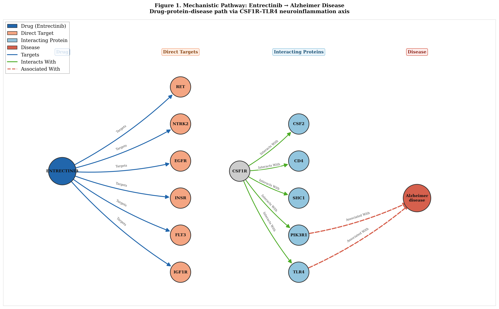

# Drug Repurposing via Knowledge Graph Embedding + ESM2 Protein Language Models

> Identifying novel therapeutic candidates through multi-relational graph learning over a 973K-triple biomedical knowledge graph, extended with protein sequence embeddings from ESM2-650M.

**Preprint:** [ChemRxiv](https://chemrxiv.org/doi/full/10.26434/chemrxiv.15004946) &nbsp;|&nbsp; **Stack:** PyKEEN · PyTorch · ESM2 · Neo4j · Scanpy · PyG

---

## Overview

This project constructs a large-scale biomedical knowledge graph from four heterogeneous databases and trains knowledge graph embedding (KGE) models to predict novel drug–disease associations. A subsequent ESM2 extension enriches protein nodes with 1,280-dimensional sequence embeddings, significantly improving link prediction performance.

Key results:
- **RotatE (baseline KG):** MRR = 0.20
- **RotatE + ESM2 protein embeddings:** MRR = 0.40 (+100% improvement)
- **Top novel prediction:** Palbociclib → Bladder Cancer *(active clinical trial NCT validation)*
- **Mechanistic prediction:** Entrectinib → Alzheimer's Disease via CSF1R–TLR4 neuroinflammation axis

---

## Knowledge Graph Construction

| Source | Entity Types | Triples |
|--------|-------------|---------|
| ChEMBL | Drugs, Targets | Drug–protein interactions |
| Open Targets | Diseases, Genes | Gene–disease associations |
| STRING | Proteins | Protein–protein interactions |
| STITCH | Drugs, Proteins | Chemical–protein links |

**Total:** ~973,000 triples across ~189,000 nodes

The graph captures four relation types: `targets`, `interacts_with`, `associated_with`, `treats`.

---

## ESM2 Protein Embedding Extension

Protein nodes were enriched with sequence-level representations:

1. STRING protein IDs → UniProt accessions (via `string_to_uniprot.csv`)
2. UniProt sequences fetched → `proteins.fasta`
3. ESM2-650M embeddings generated → 1,280-dim vectors per protein
4. Projected to 128-dim via learnable linear layer, jointly trained with RotatE

This allows the model to leverage evolutionary and structural protein information beyond graph topology alone.

---

## Mechanistic Path Tracing

Beyond link prediction scores, the model traces interpretable Drug → Protein → Disease paths through the KG to provide biological rationale for each prediction.

**Example: Entrectinib → Alzheimer's Disease**



*Entrectinib targets CSF1R, which interacts with TLR4 and PIK3R1 — both associated with Alzheimer's disease via the neuroinflammation axis. This path was surfaced automatically from the KG structure.*

---

## Models Trained

| Model | MRR | Notes |
|-------|-----|-------|
| TransE | — | Baseline translational model |
| RotatE | 0.20 | Best baseline KGE |
| ComplEx | — | Complex-valued embeddings |
| GraphSAGE | — | Node-level classification |
| GAT | — | Attention-based GNN |
| **RotatE + ESM2** | **0.40** | Best overall |

---

## Top Novel Predictions

| Drug | Disease | Evidence |
|------|---------|----------|
| Palbociclib | Bladder Cancer | Active NCT clinical trial found |
| Entrectinib | Alzheimer's Disease | CSF1R–TLR4 neuroinflammation axis |

Full ranked predictions: [`data/processed/novel_predictions_esm2.csv`](data/processed/novel_predictions_esm2.csv)

---

## Repository Structure

```
drug-repurposing-kg/
│
├── src/                        # Core pipeline scripts
│   ├── build_graph.py          # KG construction from raw sources
│   ├── parse_chembl.py         # ChEMBL data parsing
│   ├── parse_string.py         # STRING PPI parsing
│   ├── parse_stitch.py         # STITCH chemical-protein parsing
│   ├── link_proteins.py        # Protein node linking across sources
│   ├── train_kge.py            # KGE model training (TransE, RotatE, ComplEx)
│   ├── evaluate_rotae.py       # Evaluation on DrugCentral temporal split
│   ├── predict.py              # Novel prediction generation
│   ├── filter_predic.py        # Prediction filtering and ranking
│   ├── mechan_path.py          # Mechanistic path tracing
│   ├── map_drugcentral_to_kg.py
│   ├── map_diseases.py
│   ├── decode_diseases.py
│   ├── fetch_all_diseases.py
│   ├── baseline.py             # Jaccard similarity baseline
│   ├── visualise_network.py    # Network visualization
│   └── load_neo4j.py           # Neo4j graph loading
│
├── esm_extension/              # ESM2 protein embedding extension
│   ├── step1_map_uniprot.py    # STRING → UniProt ID mapping
│   ├── step5.py                # ESM2 embedding generation
│   ├── step6.py                # Embedding projection + RotatE retraining
│   └── vis.py                  # ESM2 extension visualization
│
├── data/
│   ├── processed/              # Outputs and intermediate files
│   │   ├── novel_predictions.csv
│   │   ├── novel_predictions_esm2.csv
│   │   ├── mechanistic_paths.csv
│   │   ├── evaluation_results.csv
│   │   ├── jaccard_baseline.csv
│   │   ├── dc_train.csv / dc_test.csv
│   │   └── ...
│   └── raw/                    # Raw source files (not tracked)
│
├── models/                     # Saved model weights (not tracked)
│   └── rotate_esm2/
│
├── notebooks/                  # Exploratory analysis
├── assets/                     # Figures and visualizations
└── README.md
```

---

## Evaluation

External validation uses a **DrugCentral temporal split** — drugs approved after a cutoff date are held out entirely, preventing data leakage. This is a stricter evaluation than random split and better reflects real-world repurposing utility.

---

## Setup

```bash
git clone https://github.com/YOUR_USERNAME/drug-repurposing-kg.git
cd drug-repurposing-kg
python -m venv venv
source venv/bin/activate  # Windows: venv\Scripts\activate
pip install -r requirements.txt
```

**Dependencies:** PyTorch, PyKEEN, PyTorch Geometric, fair-esm, Scanpy, Neo4j Python driver, RDKit, pandas, matplotlib

---

## Citation

If you use this work, please cite the ChemRxiv preprint:

```
@article{sankar2026drug,
  title={Drug Repurposing via Biomedical Knowledge Graph Embedding},
  author={Sankar, Rhea},
  journal={ChemRxiv},
  year={2026},
  doi={10.26434/chemrxiv.15004946}
}
```